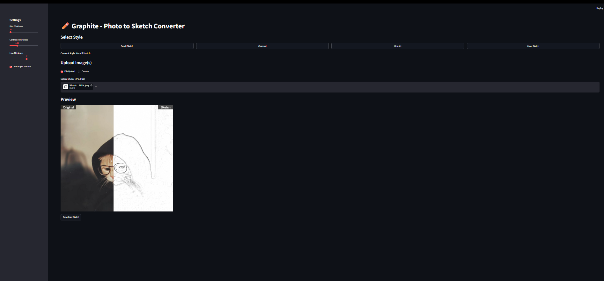

# Graphite

Graphite is a photo-to-sketch converter web app built with Python and Streamlit.

## Features
- **4 Art Styles**: Pencil Sketch, Charcoal, Line Art, and Color Sketch.
- **Adjustable Controls**: Fine-tune blur, contrast, line thickness, and add a procedural paper texture.
- **Interactive Preview**: Drag the slider to compare the original image with the generated sketch.
- **Batch Processing**: Upload multiple images at once and download a ZIP file of all sketches.
- **FastAPI Endpoint**: Includes an API endpoint (`/convert`) to use the core conversion logic outside of the UI.



## Setup Instructions

### 1. Requirements
Ensure you have Python 3.8+ installed.

### 2. Install Dependencies
```bash
pip install -r requirements.txt
```

### 3. Run the Streamlit App
```bash
streamlit run app.py
```
This will open the web interface in your default browser.

### 4. Run the API (Optional)
If you want to use the API endpoints directly:
```bash
uvicorn api:app --reload
```
You can then access the interactive API docs at `http://127.0.0.1:8000/docs`.

## How to Use

1. **Upload an Image**: Drag and drop your photos into the upload area or click to browse. You can also use the **Camera** option to take a live photo.
2. **Select a Style**: Choose between *Pencil Sketch*, *Charcoal*, *Line Art*, and *Color Sketch* using the preset cards at the top.
3. **Adjust Settings**: Use the sidebar to fine-tune the sketch:
   - **Blur / Softness**: Controls the smoothness of the shading and lines.
   - **Contrast / Darkness**: Adjusts the overall brightness and punch of the image.
   - **Line Thickness**: Modifies the edge detection strength (primarily affects Line Art and Color Sketch).
   - **Add Paper Texture**: Blends a realistic, procedural paper grain onto your sketch.
4. **Compare**: Drag the slider on the preview image left and right to compare your original photo with the generated sketch.
5. **Download**: Click **Download Sketch** to save the result as a PNG. If you uploaded multiple images, they will process as a batch, and you can click **Download All as ZIP**.

## Contributing
Contributions are welcome! Please open an issue or submit a pull request.

## License
MIT License


